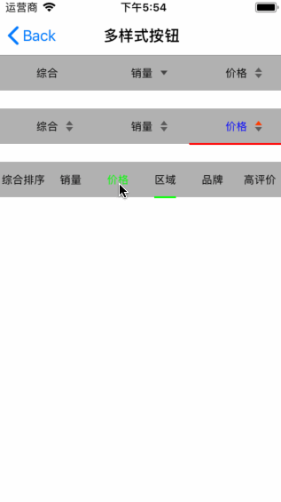

# SYTypeButtonView
多样式类型按钮视图


## 效果图




* 使用介绍
  * 自动导入：使用命令`pod 'SYTypeButtonView'`导入到项目中
  * 手动导入：或下载源码后，将源码添加到项目中
  
  
  
## 使用说明


头文件
```
#import "SYTypeButtonView.h"
```

实例化
```
SYTypeButtonView *buttonView = [[SYTypeButtonView alloc] initWithFrame:CGRectMake(0.0, 0.0, CGRectGetWidth(self.view.bounds), heightTypeButtonView) view:self.view];
```

响应回调
```
buttonView.buttonClick = ^(NSInteger index, BOOL isDescending){
    NSLog(@"click index %ld, isDescending %d", index, isDescending);
};
```

字体大小
```
buttonView.titleFont = [UIFont systemFontOfSize:13.0f];
buttonView.titleFontSelected = [UIFont systemFontOfSize:15.0f];
```

字体颜色
```
buttonView.titleColorNormal = [UIColor blackColor];
buttonView.titleColorSelected = [UIColor greenColor];
```

显示滚动条
```
buttonView.showScrollLine = YES;
buttonView.scrollLineColor = [UIColor greenColor];
buttonView.adjustScrollLineWidth = YES;
```

标题数组、图标数组等属性
```
buttonView.titles = @[@"综合", @"销量", @"价格"];
buttonView.enableTitles = @[@"价格"];
buttonView.imageTypeArray = @[[NSDictionary dictionary],
[NSDictionary dictionaryWithObjectsAndKeys:[UIImage imageNamed:@"accessoryArrow_down"], keyImageNormal, [UIImage imageNamed:@"accessoryArrow_downSelected"], keyImageSelected, nil],
[NSDictionary dictionaryWithObjectsAndKeys:[UIImage imageNamed:@"priceImage_normal"], keyImageNormal, [UIImage imageNamed:@"priceImage_down"], keyImageSelected, [UIImage imageNamed:@"priceImage_up"], keyImageSelectedDouble, nil]];
```

设置默认选中按钮
```
buttonView.selectedIndex = 2;
```

设置默认选中按钮及其状态
```
[buttonView setTypeButton:NO index:2];
```

# 修改说明
* 20180812
  * 版本号：2.1.1
  * 修改异常
  
  * 版本号：2.1.0
  * 修改完善
    * 自定义滚动条颜色
    * 数组存储取按钮
    * 滚动条适应标题宽度
      * 字典缓存宽度，避免多次计算
    
* 20180801
  * 版本号：2.0.1
  * 修改完善
  
* 20171229
  * 版本号：2.0.0
  * 完善逻辑
    * 设置选择项selectedIndex小于0时，取消所有选中项，且都有可选状态，如：-1取消默认选中项，且全部可选
    * 新增可设置某个多选状态选项的具体状态，如：设置销量的升序状态

* 20171017
  * 版本号：1.0.1
  * 源码与示例分离

* 20170424
  * SYTypeButton修改bug
    * 导航动画线初始化时显示bug

* 20170421
  * SYTypeButton添加属性及修改默认选项逻辑
    * 默认选项逻辑：只处理选项状态，不响应事件交互。
    
~~~ javascript
/// 选中后字体大小（默认12。设置标题后设置）
@property (nonatomic, strong) UIFont *titleFontSelected;
~~~
